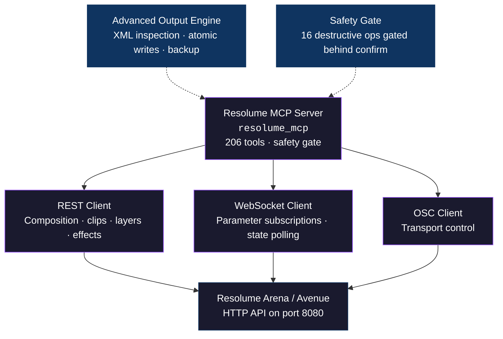

<p align="center">
  
</p>

# Resolume MCP

<p align="center">
  <a href="https://github.com/drohi-r/resolume-mcp/blob/main/LICENSE"></a>
  
  
</p>

An MCP server for [Resolume Arena and Avenue](https://resolume.com). Exposes 206 tools covering composition control, playback, Advanced Output management, and show recovery — so AI assistants can operate Resolume via REST, WebSocket, and OSC.

Built for live production. Pairs with [grandMA2 MCP](https://github.com/drohi-r/grandma2-mcp), [MADRIX MCP](https://github.com/drohi-r/madrix-mcp), [Companion MCP](https://github.com/drohi-r/companion-mcp), and [Beyond MCP](https://github.com/drohi-r/beyond-mcp) for full AI-driven show control.

## What it does

| Area | What you get |
|------|-------------|
| **Composition control** | Layers, clips, columns, groups, decks — get snapshots, trigger playback, manage media, batch operations |
| **Advanced Output** | Screen and slice management via both REST API and XML inspection. Backup, diff, rename, reroute, warp alignment |
| **Playback & monitoring** | Transport control, parameter subscriptions, state polling, show-readiness audits |
| **Effects** | Add, remove, move, rename effects across composition, layer, group, and clip scopes |
| **Safety** | 16 destructive operations gated behind `confirm_destructive=True`. Atomic XML writes. Crash-resilient polling |

## Quick start

```bash
# Clone and install
git clone https://github.com/drohi-r/resolume-mcp && cd resolume-mcp
uv sync

# Run the server (connects to Resolume on localhost:8080)
uv run python -m resolume_mcp
```

Make sure Resolume Arena or Avenue is running with the REST API enabled (Preferences → OSC/HTTP → HTTP API).

For remote control:
- use LAN or WireGuard, not the public internet
- set `RESOLUME_HOST` to the remote machine
- include that host in `RESOLUME_ALLOWED_HOSTS`

## Configuration

The server reads configuration from environment variables. All have sensible defaults for local development.

| Variable | Default | Description |
|----------|---------|-------------|
| `RESOLUME_HOST` | `127.0.0.1` | Resolume instance IP |
| `RESOLUME_HTTP_PORT` | `8080` | HTTP API port |
| `RESOLUME_OSC_PORT` | `7000` | OSC listener port |
| `RESOLUME_ALLOWED_HOSTS` | `127.0.0.1,localhost,::1` | Comma-separated allowlist for target hosts. Set `*` to allow any. |
| `RESOLUME_USE_HTTPS` | `false` | Use HTTPS for API calls (`true`, `yes`, `1`) |
| `RESOLUME_DOCUMENTS_ROOT` | `~/Documents/Resolume Arena` | Resolume documents path |
| `RESOLUME_ADVANCED_OUTPUT_XML` | `~/Documents/Resolume Arena/Preferences/AdvancedOutput.xml` | Advanced Output XML path |
| `RESOLUME_SLICES_XML` | `~/Documents/Resolume Arena/Preferences/slices.xml` | Slices XML path |

## Architecture



## Claude Desktop

Add this to your Claude Desktop config (`~/Library/Application Support/Claude/claude_desktop_config.json`):

```json
{
  "mcpServers": {
    "resolume": {
      "command": "uv",
      "args": ["run", "--directory", "/path/to/resolume-mcp", "python", "-m", "resolume_mcp"],
      "env": {
        "RESOLUME_HOST": "127.0.0.1",
        "RESOLUME_HTTP_PORT": "8080",
        "RESOLUME_ALLOWED_HOSTS": "127.0.0.1,localhost,::1"
      }
    }
  }
}
```

## VS Code / Cursor

Add to `.vscode/mcp.json` in your project:

```json
{
  "servers": {
    "resolume": {
      "command": "uv",
      "args": ["run", "--directory", "/path/to/resolume-mcp", "python", "-m", "resolume_mcp"],
      "env": {
        "RESOLUME_HOST": "127.0.0.1",
        "RESOLUME_HTTP_PORT": "8080",
        "RESOLUME_ALLOWED_HOSTS": "127.0.0.1,localhost,::1"
      }
    }
  }
}
```

## Skills

The server includes 7 operator skills — structured workflows for common live-show scenarios:

| Skill | When to use |
|-------|-------------|
| `playback-prep-and-busking` | Preparing Resolume for a live run or operator handoff |
| `advanced-output-setup` | Setting up screens, slices, and routing for a show |
| `output-routing-festival` | Fast rerouting for festival or guest rig changes |
| `output-warp-alignment` | Aligning screen geometry and slice warping |
| `festival-recovery-fast` | Recovering a show under time pressure |
| `show-recovery-and-triage` | Diagnosing transport, output, or layer issues |
| `deck-control-and-inspection` | Managing deck snapshots, audits, and parameters |

## Safety model

- **Read operations** (snapshots, audits, parameter gets): always safe, no confirmation needed
- **Destructive operations** (clear, disconnect, remove): require `confirm_destructive=True`
- **Host allowlisting**: only `127.0.0.1`, `localhost`, and `::1` are permitted by default. Add LAN hosts explicitly via `RESOLUME_ALLOWED_HOSTS`. Set `*` to allow any host.
- **Advanced Output XML writes**: atomic (temp file + rename) to prevent corruption
- **Polling loops**: crash-resilient — return last known state if Resolume becomes unreachable

## Development

```bash
# Install and sync dependencies
uv sync

# Run tests
uv run python -m pytest -v
```

## License

[Apache 2.0](LICENSE)
