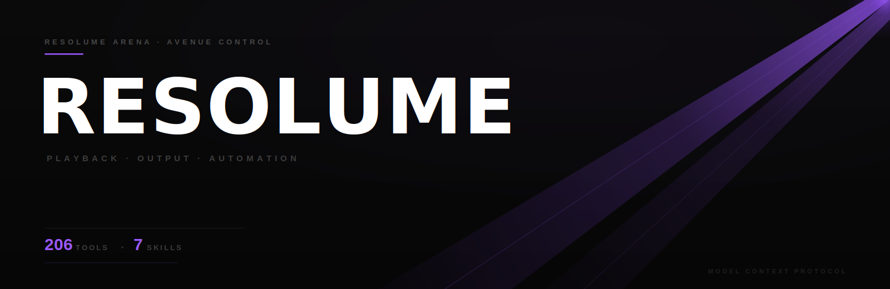

  

# Resolume MCP

Private MCP server project for Resolume Arena/Avenue control.

Planned focus:
- composition and transport control
- layers, clips, columns, groups
- advanced output: screens, slices, routing, output parameter control
- playback triggers and parameter control
- safe read/write separation
- Resolume REST/OSC integration where appropriate

Status:
- generic REST / WebSocket / OSC foundation in place
- live validation completed against the local Resolume instance on this machine
- current live validation was performed on macOS, but the intended production targets are Windows media servers
- composition, layer, clip, and deck helpers now resolve live websocket parameters through `/parameter/by-id/{id}` where the local REST schema exposes them
- product, effects, sources, and file-info discovery helpers are now wrapped by named tools
- Advanced Output XML inspection, backup, and diff tools are now in place for local Resolume installations that persist output setup to XML
- clip audit, batch clip trigger/disconnect, and batch layer clear helpers in place
- playback preparation helpers in place for composition and layers, with composition transport control treated as build-dependent
- playback monitoring and batch selection helpers in place
- playback subscribe/unsubscribe bundles in place
- source/media wrappers in place for clip open, openfile, insert, and thumbnail refresh workflows
- thumbnail revert helpers in place for clip and selected clip
- `open` is live-proven on this build when sent as raw `text/plain file:///...`
- effect-management wrappers in place for composition, layer, group, and clip scopes:
  - add
  - remove
  - get
  - video-effect move
  - display-name rename
- structural wrappers in place for:
  - composition new/open/save/grow-to
  - disconnect-all
  - add/duplicate for layers, columns, groups, and decks
  - deck open/close
  - group add-layer, move-layer, and clear
  - selected group clear
  - group-column get/select/connect
  - layer clearclips
  - selected layer/group duplicate
- Advanced Output screen and slice wrappers are present but currently experimental on this machine because the local Resolume 7 HTTP API returns `404` for the probed Advanced Output endpoints
- Advanced Output XML tools are the current production-safe path on this machine:
  - summary
  - screen inspection
  - slice inspection
  - Windows path candidates
  - local path probe
  - backup
  - diff
  - export bundle
  - preview restore
  - backup-first restore
  - guarded XML edits for screen name, slice name, and soft-edge power
  - guarded XML edits for output device, input rect, output rect, and homography destination
- deck access and deck-parameter helpers in place
- deck snapshot and audit helpers are live-verified against the current deck schema
- deck prep and transport-style deck helpers are intentionally conservative because the validated deck schema does not expose deck transport fields
- column trigger/disconnect helpers in place
- selected-object wrappers in place for currently exposed layer and clip selection/state surfaces, with some selected-group and active-clip paths remaining build-dependent on this machine
- selected-clip trigger/disconnect helpers are now wrapped
- clip effect add and delete are now live-proven on a disposable slot when sent with raw `text/plain` effect URIs
- output screen/slice parameter-path helpers in place
- output transform helper in place for common slice transform updates
- composition/layer/clip parameter monitoring helpers in place
- output screen/slice subscribe helpers in place
- output corner helper in place for common warp-style updates
- batch output helpers in place for multi-screen and multi-slice updates
- batch slice routing helper in place for fast Advanced Output input assignment
- composition overview and layer/clip snapshot readers in place
- output overview and screen/slice snapshot readers in place
- composition audit and layer audit helpers in place
- output screen audit and all-screen audit helpers in place
- output preparation helper in place for fast screen enable/unbypass/opacity setup
- multi-screen preparation helper in place
- show-readiness audit helper in place

Local skill layer:
- `advanced-output-setup`
- `deck-control-and-inspection`
- `festival-recovery-fast`
- `output-routing-festival`
- `output-warp-alignment`
- `playback-prep-and-busking`
- `show-recovery-and-triage`

Internal docs:
- `docs/GETTING-STARTED.md`
- `docs/LIVE-VALIDATION.md`
- `docs/SESSION-HANDOVER.md`
